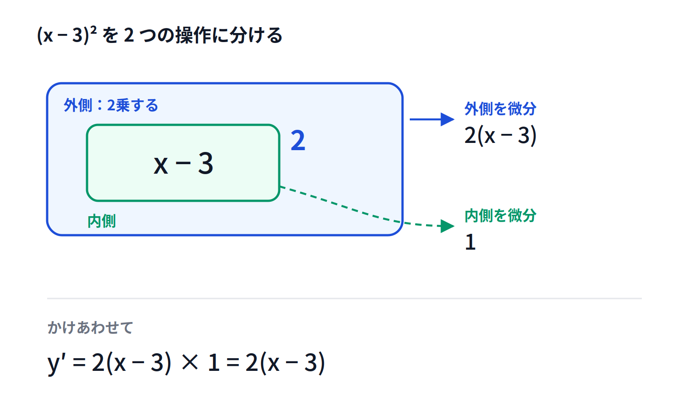

# かっこのついた式の微分（合成関数）

## この節でわかること

+ $y = (x - 3)^2$ のような、かっこのついた式を微分できる
+ 展開してから微分する方法と、合成関数として微分する方法の2通りがわかる
+ どちらでも同じ答えになることを確かめられる

## ここまでの流れ

+ べき乗・定数倍・和差の3つのルールを覚えた
+ これで多項式は微分できるようになった
+ ただし、線形回帰で出てくる式はかっこのついた形をしている

> 💬 まずは展開できる簡単な形で、2通りのやり方を比べます。

## 考えてみよう

+ $y = (x - 3)^2$ を微分したい
+ べき乗のルールをそのまま当てはめると $2(x - 3)$ になりそう
+ 本当にそれでよいのかは、まだ分からない

> 💬 確かめる方法があります。展開してから微分してみることです。

## 方法1 展開してから微分する

+ かっこを外して $(x - 3)^2 = x^2 - 6x + 9$
+ 項ごとに微分して $y' = 2x - 6$
+ 共通の $2$ でくくると $y' = 2(x - 3)$

> 💡 前の節の3つのルールだけで答えが出ました。

## 方法2 外側と内側に分ける

+ $(x - 3)^2$ を、2つの操作の組み合わせとみる
+ 内側は「$3$ を引く」、外側は「2乗する」
+ **外側を微分したもの $\times$ 内側を微分したもの**
+ 外側は $2(x - 3)$、内側は $(x - 3)' = 1$
+ かけあわせて $y' = 2(x - 3) \times 1 = 2(x - 3)$

> 💡 方法1と同じ答えになりました。

## 連鎖律

+ 内側をひとまとまりとみて $u = x - 3$ と置く
+ すると $y = u^2$ という簡単な形になる
+ $\frac{dy}{dx} = \frac{dy}{du} \times \frac{du}{dx}$
+ この決まりを**連鎖律**（合成関数の微分）という

> 💬 鎖のように、外側と内側の微分をつないでいく形です。

## どちらを使うのか

+ 展開できる式なら、方法1でも方法2でもよい
+ **展開できない式では、方法2しか使えない**
+ 線形回帰の式は項の数が多く、展開すると手に負えなくなる

> 💡 いまのうちに方法2に慣れておくと、後がずっと楽になります。

## 内側の微分を忘れない

+ 内側が $x$ だけのときは、内側の微分が $1$ なので目立たない
+ 内側に係数がつくと、その数がそのまま出てくる
+ $y = (2x - 3)^2$ なら、内側の微分は $2$
+ $y' = 2(2x - 3) \times 2 = 4(2x - 3)$

> ⚠️ 内側の微分をかけ忘れるのが、いちばん多いまちがいです。

## 例1 内側の係数が1

> 💬 $y = (x + 4)^2$ を微分しましょう。

+ 外側を微分して $2(x + 4)$
+ 内側を微分して $(x + 4)' = 1$
+ かけあわせて $y' = 2(x + 4)$

## 例2 内側に係数がある

> 💬 $y = (3x - 1)^2$ を微分しましょう。

+ 外側を微分して $2(3x - 1)$
+ 内側を微分して $(3x - 1)' = 3$
+ かけあわせて $y' = 6(3x - 1)$

> 💡 展開すると $9x^2 - 6x + 1$、微分して $18x - 6 = 6(3x - 1)$。検算できました。

## 例3 内側の符号が逆のとき

> 💬 $y = (5 - x)^2$ を微分しましょう。

+ 外側を微分して $2(5 - x)$
+ 内側を微分して $(5 - x)' = -1$
+ かけあわせて $y' = -2(5 - x)$

> ⚠️ 内側が $-x$ の形のときは、マイナスが前に出ます。落としやすい箇所です。

## 気をつけること

+ 内側の微分をかけ忘れない
+ 内側の $x$ にマイナスがついているときは、符号を確認する
+ 不安なときは、展開して微分し、答えを突き合わせる

> ⚠️ $y = (5 - x)^2$ の答えを $2(5 - x)$ としないこと。マイナスが必要です。

## まとめ

+ かっこのついた式は、**外側と内側に分けて**微分する
+ **外側を微分したもの $\times$ 内側を微分したもの**
+ この決まりを**連鎖律**という
+ 展開できる式なら、展開して微分しても同じ答えになる
+ 内側の微分をかけ忘れない。特に符号に注意する