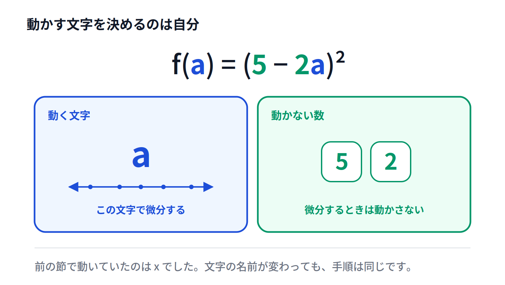

# 変数が入れかわる ― $a$ で微分する

## この節でわかること

+ $x$ 以外の文字でも微分できる
+ 式の中で、どれを動かすのかを自分で決められる
+ $f(a) = (5 - 2a)^2$ を $a$ で微分できる

## ここまでの流れ

+ 動く文字と動かない文字を見分けられるようになった
+ ただし、そこでは動く文字はいつも $x$ だった
+ こんどは、動く文字が $x$ 以外になる

> 💬 ここがこの章でいちばんの山です。ゆっくり進みます。

## 考えてみよう

+ $f(a) = (5 - 2a)^2$ という式がある
+ 見た目は $(c - x)^2$ とよく似ている
+ ちがうのは、動く文字が $a$ で、動かないほうが $5$ と $2$ であること

> 💬 $x$ が見あたりません。それでも、やることは変わりません。

## 変数は文字の名前では決まらない

+ 「$x$ だから変数、$c$ だから定数」ではない
+ どの文字を動かすかは、こちらが決めること
+ $f(a)$ という書き方は「これは $a$ の式です」という宣言

> 💡 文字の名前ではなく、**役割**を見ます。

## 記号の読み方

+ $f(a)$ は「$a$ の式」
+ $\frac{df}{da}$ は「$f$ を $a$ で微分する」
+ 分母に書いた文字が、動かす文字

> 💬 $\frac{dy}{dx}$ の $x$ が $a$ に変わっただけです。

## 例1 いちばん簡単な形

> 💬 $f(a) = a^2$ を $a$ で微分しましょう。

+ $x^2$ の $x$ を $a$ に置きかえただけの形
+ べき乗のルールをそのまま使う
+ $\frac{df}{da} = 2a$

## 例2 一次の項

> 💬 $f(a) = 3a$ を $a$ で微分しましょう。

+ $a = a^1$ なので、肩の $1$ を降ろす
+ 肩は $0$ になり、$a^0 = 1$ が残る
+ $\frac{df}{da} = 3$

> 💡 一次の項は係数だけが残る。01-01 で確かめたとおりです。

## 例3 内側に $a$ がある

> 💬 $f(a) = (5 - 2a)^2$ を $a$ で微分しましょう。

+ 外側を微分して $2(5 - 2a)$
+ 内側を微分する。$5$ は消え、$-2a$ からは $-2$ が出る
+ 内側の微分は $(5 - 2a)' = -2$
+ かけあわせて $\frac{df}{da} = 2(5 - 2a) \times (-2) = -4(5 - 2a)$

> ⚠️ 内側の微分は $-1$ ではなく $-2$ です。$a$ についている係数がそのまま出ます。

## 前の節と見くらべる

+ $(c - x)^2$ を $x$ で微分すると $-2(c - x)$
+ $(5 - 2a)^2$ を $a$ で微分すると $-4(5 - 2a)$
+ 手順はまったく同じ。内側の微分が $-1$ から $-2$ に変わっただけ

> 💡 新しいルールは何も増えていません。役割が入れかわっただけです。

## 線形回帰では何が動くのか

+ データの $x_i$ と $y_i$ は、すでに測り終えていて動かせない
+ 動かせるのは、これから決める直線の傾き $a$ と切片 $b$
+ だから、$a$ や $b$ で微分することになる

> 💬 データは動かない。動かすのは直線のほうです。

## 気をつけること

+ 微分する前に、どの文字を動かすかを決める
+ 決めた文字以外は、すべて数と同じ扱いにする
+ 内側の文字についている係数が、そのまま前に出てくる

> ⚠️ $(5 - 2a)^2$ の答えを $-2(5 - 2a)$ としないこと。内側の $-2$ をかけ忘れています。

## まとめ

+ 変数は文字の名前では決まらない。**動かすと決めた文字**が変数
+ $f(a)$ は「$a$ の式」、$\frac{df}{da}$ は「$a$ で微分する」
+ 手順は $x$ のときとまったく同じ
+ $f(a) = (5 - 2a)^2$ を $a$ で微分すると $-4(5 - 2a)$
+ 線形回帰で動かすのは、データではなく**直線の傾きと切片**