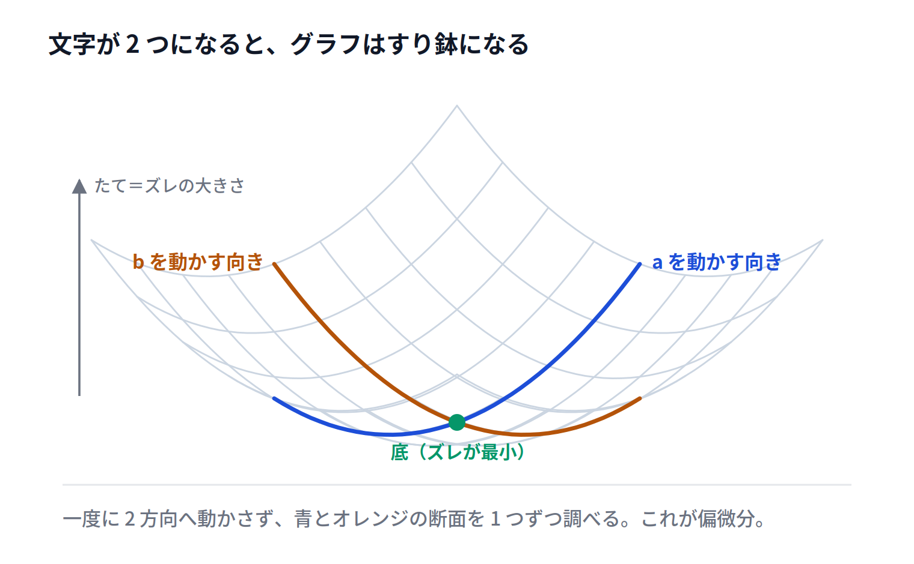

# $\Sigma$ のついた式を偏微分する

## この節でわかること

+ $\Sigma$ のついた式を微分できる
+ 線形回帰の誤差 $E(a, b)$ を $a$、 $b$ で偏微分できる
+ 偏微分を $0$ とおいて、傾きと切片を求める式を導ける

## ここまでの流れ

+ 文字を1つに絞って偏微分できるようになった
+ 残っているのは、データがいくつもあるという点だけ
+ ここを越えれば、線形回帰の式に届く

> 💬 この節が最後です。ここまでの道具だけで解けます。

## 考えてみよう

+ 線形回帰で小さくしたいのは、次の式
+ $E(a, b) = \sum_{i=1}^{n} \bigl(y_i - (a x_i + b)\bigr)^2$
+ 1つ前に扱った $\bigl(5 - (2a + b)\bigr)^2$ と見くらべる

> 💬 $5$ が $y_i$ に、 $2$ が $x_i$ に変わり、 $\Sigma$ がついただけです。

## 記号を読む

+ $x_i$ と $y_i$ は、 $i$ 番目のデータの値
+ 添え字の $i$ は「何番目か」を表す番号
+ $\sum_{i=1}^{n}$ は「1番目から $n$ 番目まで足す」

> 💡 $\Sigma$ は「たくさん足す」の記号にすぎません。

## データは動かない

+ $x_i$ と $y_i$ は、すでに測り終えた数
+ 動かせるのは、これから決める $a$ と $b$ だけ
+ つまり $E$ は、 $a$ と $b$ の式

> ⚠️ 添え字 $i$ のついた文字は、すべて動かない数です。

## $\Sigma$ は微分の外に出せる

+ 和は項ごとに分けて微分できた
+ 足す項が $n$ 個あっても、同じことができる
+ $\frac{\partial}{\partial a} \sum \bigl(\cdots\bigr) = \sum \frac{\partial}{\partial a} \bigl(\cdots\bigr)$

> 💡 $\Sigma$ の中を1つ微分すれば、同じ形が $n$ 個並ぶだけです。

## 例1 $a$ で偏微分する

> 💬 $E(a, b) = \sum \bigl(y_i - (a x_i + b)\bigr)^2$ を $a$ で偏微分しましょう。

+ まず $\Sigma$ の中を1つ取り出す
+ 外側を微分して $2\bigl(y_i - (a x_i + b)\bigr)$
+ 内側を $a$ で微分する。 $y_i$ と $b$ は定数なので $0$
+ $-a x_i$ の部分が残り、内側の微分は $-x_i$
+ かけあわせて $-2 x_i \bigl(y_i - (a x_i + b)\bigr)$
+ $\Sigma$ を戻して $\frac{\partial E}{\partial a} = -2 \sum x_i \bigl(y_i - (a x_i + b)\bigr)$

> ⚠️ 内側の微分は $-x_i$ です。 $x_i$ は $a$ についている係数なので、そのまま前に出ます。

## 例2 $b$ で偏微分する

> 💬 同じ式を、こんどは $b$ で偏微分しましょう。

+ 外側は例1とまったく同じ
+ 内側を $b$ で微分する。 $y_i$ と $a x_i$ は定数なので $0$
+ $-b$ の部分が残り、内側の微分は $-1$
+ かけあわせて $\frac{\partial E}{\partial b} = -2 \sum \bigl(y_i - (a x_i + b)\bigr)$

> 💡 ここでも、ちがうのは内側の微分だけでした。

## すり鉢の底を探す

+ データが2点以上あると、$E$ のグラフはすり鉢の形になる
+ 底では、 $a$ の向きにも $b$ の向きにも傾きが $0$
+ 求める条件は $\frac{\partial E}{\partial a} = 0$ かつ $\frac{\partial E}{\partial b} = 0$

> 💬 1つの文字のときに「微分して $0$ とおいた」のと、やっていることは同じです。

## 2本の式が出てくる

+ 右辺が $0$ なので、前についた $-2$ は消せる
+ $\sum x_i \bigl(y_i - (a x_i + b)\bigr) = 0$
+ $\sum \bigl(y_i - (a x_i + b)\bigr) = 0$
+ この2本を**正規方程式**という

> 💡 $a$ と $b$ についての連立一次方程式です。あとは解くだけです。

## 気をつけること

+ $\Sigma$ は微分の外に出せる。中を1つ微分すればよい
+ 内側の微分で $x_i$ が出るのは、 $x_i$ が $a$ の係数だから
+ 右辺が $0$ のときだけ、前の $-2$ を消せる

> ⚠️ $\Sigma$ の中の $x_i$ を、微分のときに消さないこと。データは残ります。

## まとめ

+ $\Sigma$ は微分の外に出せる。**中を1つ微分すればよい**
+ データ $x_i$、$y_i$ は動かない。動かすのは $a$ と $b$
+ $\frac{\partial E}{\partial a} = -2 \sum x_i \bigl(y_i - (a x_i + b)\bigr)$
+ $\frac{\partial E}{\partial b} = -2 \sum \bigl(y_i - (a x_i + b)\bigr)$
+ 両方を $0$ とおいた2本の式を**正規方程式**といい、連立して $a$ と $b$ を求める
